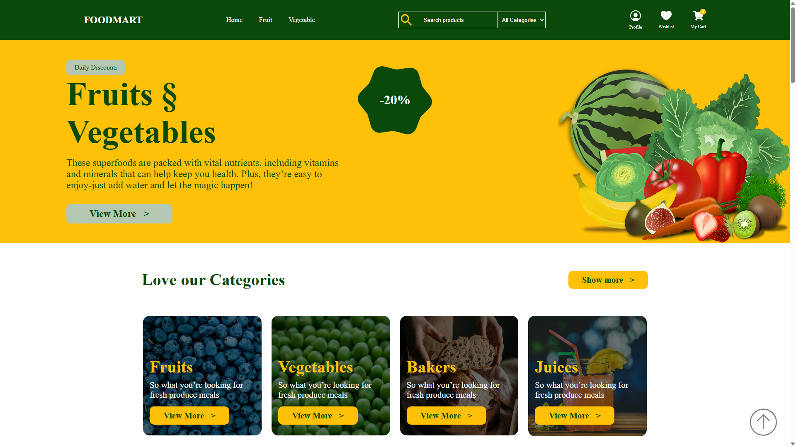

<p align="center">
  🇺🇸 <a href="README.md">English</a> | 🇮🇷 <strong>فارسی</strong>
</p>

<h1 align="center">🥗 صفحه لندینگ فروشگاهی میوه و سبزیجات</h1>


<p align="center">
  
</p>

<p align="center">
  یک صفحه لندینگ مدرن و چشم نواز برای فروشگاه آنلاین میوه و سبزیجات تازه.
</p>

<p align="center">
  
  
  
  
</p>

<p align="center">
  <a href="https://korosh-pirfalak.github.io/fruits-vegetables-website">
    
  </a>
</p>

---

## 📖 توضیحات

این پروژه با استفاده از HTML، CSS و JavaScript و با هدف تمرین مهارت های توسعه فرانت اند ساخته شده است.

تمرکز این پروژه بر ساختار کدنویسی تمیز، اسکرول نرم و ارائه تجربه کاربری مناسب است.

---

## 🛠 تکنولوژی‌های استفاده‌شده

<p>
  
  
  
</p>

---

## ✨ ویژگی‌ها

- 🎨 رابط کاربری مدرن و تمیز
- ⚡ اسکرول نرم
- 🚀 سبک و سریع
- 🧩 ساختار کدنویسی تمیز

---

## 🎯 اهداف آموزشی

این پروژه با هدف تمرین و تقویت مهارت‌های زیر توسعه داده شده است:

- HTML5 معنایی (Semantic HTML5)
- طراحی مدرن با Flexbox
- ساختاردهی تمیز پروژه
- کار با Git و GitHub

---

## 📱 وضعیت واکنش‌گرایی

| دستگاه | وضعیت |
| :------ | :---: |
| 🖥️ نمایشگرهای بزرگ | ✅ |
| 📱 موبایل | 🚧 به‌زودی |
| 💻 دسکتاپ و لپ‌تاپ | 🚧 به‌زودی |
| 📟 تبلت | 🚧 به‌زودی |

---

## 📂 ساختار پروژه

```text
📦 fruits-vegetables-website
├── assets/
├── icon/
├── img/
├── js/
├── style/
├── favicon.ico
├── index.html
├── LICENSE
├── README.fa.md
└── README.md
```
---

## 🤝 مشارکت

از مشارکت، ثبت باگ و ارائه پیشنهادهای جدید استقبال می‌شود.

برای مشارکت:

1. از پروژه Fork بگیرید.
2. یک شاخه (Branch) جدید ایجاد کنید.
3. تغییرات خود را Commit کنید.
4. یک Pull Request ارسال کنید.

---

## 📄 مجوز

این پروژه تحت مجوز MIT منتشر شده است.

برای اطلاعات بیشتر، فایل LICENSE را مطالعه کنید.

---

## 👨‍💻 توسعه‌دهنده

کوروش پیرفلک

⭐ اگر این پروژه برایتان مفید بود، خوشحال می‌شوم با دادن یک Star از آن حمایت کنید.